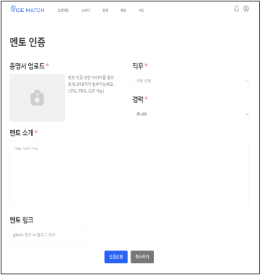

# Side Match
💻 개발자 프로젝트, 스터디 팀원 모집은 Side Match 
   

## 🍀 개요
Side Match는 검증된 팀원과 프로젝트, 스터디를 매칭하고 멘토링을 통해 본인의 코드를 리뷰 받을 수 있는 서비스입니다. 
   

### 구체화 과정

<a href="https://www.figma.com/file/DKG04lkMFONBF22oF0zvgC/minisoma?type=design&node-id=0%3A1&mode=design&t=SKHlA5zluCUyWoLm-1">
피그마 링크
</a>

### 최종 페이지

<a href="https://www.figma.com/file/PSbPOcHh8gClOYGuLZGZot/Basket's-team-library-(Copy)?type=design&node-id=0%3A1&mode=design&t=5Zib6z4lqWchq6DO-1"> 피그마 링크 </a>

## ⚡️ 주요 기능
### ✅ 메인페이지

* 개설된 프로젝트/스터디의 목록을 보여주고, 유저가 팀의 종류(웹,앱,AI등)를 선택하거나 이름으로 팀을 검색 할 수 있습니다.

### ✅ 팀 설명

* 프로젝트/스터디 카드를 선택하면, 해당 팀의 상세 페이지를 볼 수 있습니다.
* 상세페이지에는 프로젝트 기획, 스터디 내용, 모임 장소등 같은 정보를 팀장이 입력합니다.
  
### ✅ 팀원 신청

* 팀 상세 페이지에서 팀원 지원 하기를 선택하면, 해당 팀에 지원할 수 있는 모달 창이 나와서, 해당 팀에 지원을 할 수 있습니다.
  
### ✅ 팀 생성

* 본인이 하고 싶은 프로젝트가 있는 경우 프로젝트를 직접 만들어서 팀장으로 진행 할 수 있습니다.
* 모임 설명에 하고 싶은 프로젝트의 설명을 적습니다.
* 모집 팀원의 수와 개발 스택을 정할수 있습니다.

### ✅ 팀원 영입 

* 팀원 탭에서 Side Match 사용자 목록을 볼 수 있습니다.
* 사용자 목록은 팀원이 가입하면, 자동으로 팀원이 보여지며, 팀원의 기본 정보는 회원가입 시에 받습니다.

 

* 팀원 카드를 클릭하면, 팀원 상세 페이지로 이동합니다. 팀원 상세 페이지에서는 팀원의 간단한 소개, 기술 능력치, 선호 모임 지역, 진행한 프로젝트 등을 볼 수 있습니다.

 

* 상대방을 내 프로젝트에 초대 하고 싶다면 초대하기 버튼을 통해 상대방에게 알림을 보낼수 있습니다.

### ✅ 알림 기능

* 유저에게 알림 기능을 제공 합니다.
### ✅ 채팅

* 개인은 함께하고 싶은 팀의 팀장에게 쪽지를 보낼수 있고 팀장은 함께 하고 싶은 개인에게 쪽지를 보낼수 있습니다. 
### ✅ 상호 평가

* 프로젝트/스터디 중간 중간에 상호평가 알림을 보내어 상대방이 좋은 팀원인지 평가하며 평가 내용은 상대방 프로필의 온도에 반영 됩니다. 
### ✅ 멘토 영입

* 팀을 결성하고 멘토링이 필요한 팀은 협의를 통해 유료로 멘토링을 받을수 있습니다.
### ✅ 멘토 인증 

* 멘토는 현업 개발자로 구성 되어 있으며 깃허브, 재직 증명서 등을 관리자가 검토하여 멘토 인증을 합니다. 
   

## 🛠️ 사용 기술
* Backend
  * Spring Boot
  * Spring Data JPA
  * Spring Security
  * JWT
  * WebSocket
  * Junut5
  * MySQL
  * AWS RDS
  * AWS DynamoDB
  * AWS S3
  * Sentry
  * Swagger 3.0
 
   

## 🏠 시스템 아키텍쳐

## 🏠 CI/CD

- 레포지토리의 push를 Github webhook으로 전달
- 분리된 Jenkins 서버에서 빌드를 시작
- Gradle과 nodejs plugin 빌드가 끝나면 테스트 진행
- 테스트가 성공하면 docker hub로 image push
- Jenkins 서버에서 비즈니스 서버 private ip로 접근하여 script 실행

## 📚 ERD

### 유저

### 팀

### 멘토링

### 피드

